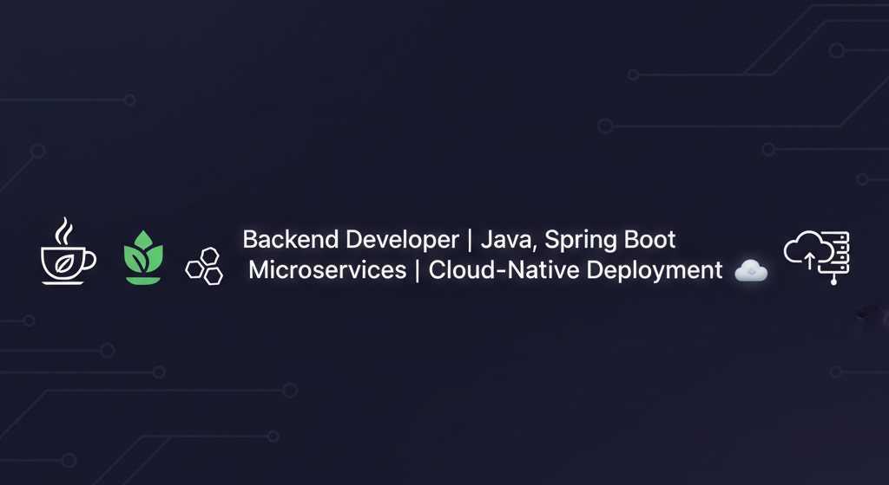

<!-- Banner -->

<h1 align="center">Hi 👋, I'm Vikas Yadav</h1>
<h3 align="center">Backend Developer | Spring Boot • REST APIs • Cloud Enthusiast 🚀</h3>

  

---

### 👨‍💻 About Me
- 🔭 Currently building **Spring Boot backend projects**
- 🌱 Learning **Spring Boot, DevOps & Cloud**
- 💬 Ask me about **Java, Spring Boot, REST APIs, Docker**
- 📫 Reach me at: **[vikasyadav0971@gmail.com](mailto:vikasyadav0971@gmail.com)**
- 📄 Check out my [**LinkedIn Profile**](https://www.linkedin.com/in/vikasydv0972)
- ⚡ Fun fact: I love building **scalable backend systems 🚀**

---

### 🛠️ Tech Stack

  
  
  
  
  
  
  
  
  
  

---

### 🚀 Featured Projects
- 📘 [**Journal Application**](https://github.com/vikasydv0972/Journal-App)  
  REST API-based journal app with Weather API, Sentiment Analysis, JWT Security, Email Notifications & Caching.

- ⚡ [**Internet Download Manager**](https://github.com/vikasydv0972/Download_Manager)  
  JavaFX desktop download manager with multi-threaded downloading & real-time progress tracking.

---

### 📊 GitHub Stats

  
  

  

---

### 🌐 Connect With Me

  
  
  

---

<h3 align="center">✨ Thanks for visiting my profile! 🚀</h3>

